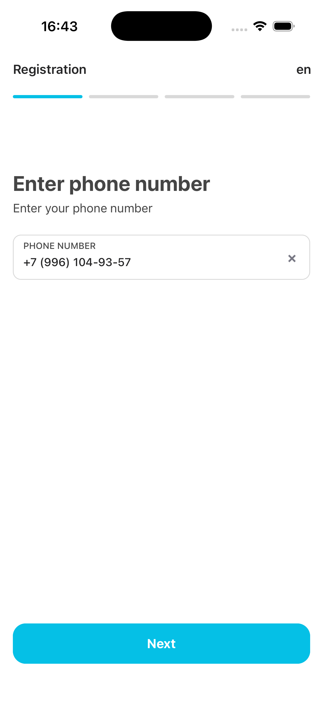
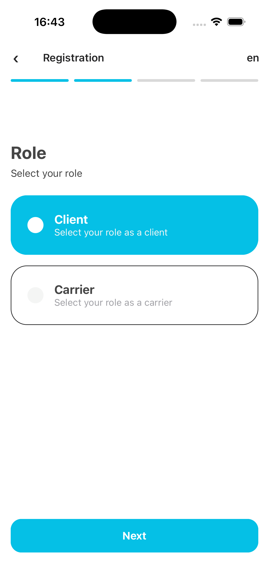
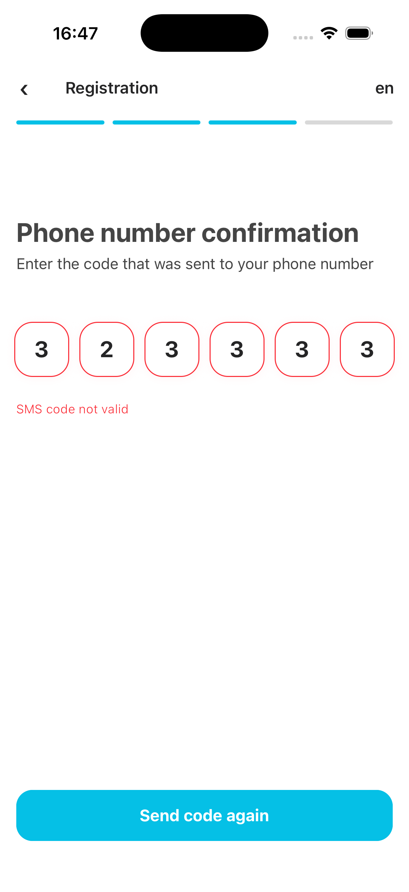
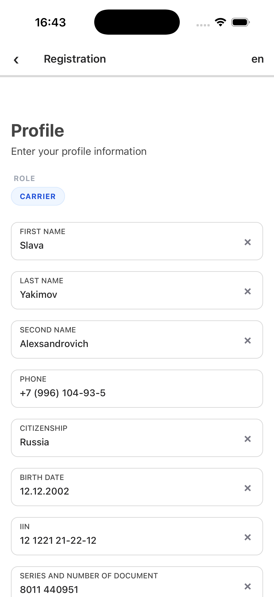
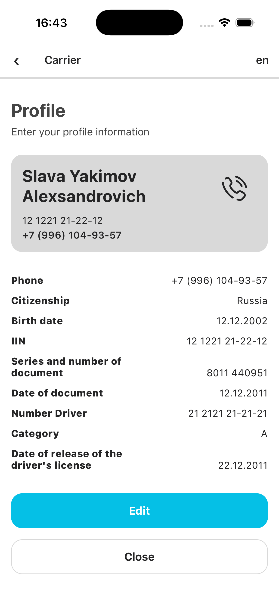

# TESTAPP (com.testapp)

Многошаговое мобильное приложение для регистрации пользователей с разделением ролей на **Клиента (Client)** и **Перевозчика (Carrier)**. Проект разработан на базе React Native 0.85 и TypeScript.

---

## 📱 Описание экранов и логики (Flow)

Приложение представляет собой последовательную многошаговую форму регистрации (Multi-step Form) со следующим флоу:

1. **Ввод номера телефона (`PhoneStep`)**
* Экран запрашивает ввод мобильного номера телефона.
* Поля ввода используют маскирование для предотвращения некорректного ввода.
* 

2. **Выбор роли (`RoleStep`)**
* Пользователь выбирает свой профиль: **Client** или **Carrier**.
* Выбранная роль сохраняется локально в `AsyncStorage` для динамической настройки полей на следующих шагах.
* 


3. **Подтверждение номера (`SMSStep`)**
* Экран ввода 6-значного SMS-кода подтверждения.
* Реализована валидация кода. При вводе неверного кода отображается ошибка *"SMS code not valid"* и активируется кнопка повторной отправки.
* 

4. **Заполнение профиля (`ProfileStep`)**
* Динамическая форма, состав полей которой зависит от выбранной роли (управляется утилитой `visibleInputs`).
* **Клиент (Client)** заполняет базовые данные: ФИО, Гражданство, Дата рождения, ИИН.
* **Перевозчик (Carrier)** заполняет расширенный набор данных, включая Номер водительского удостоверения, Категорию прав и Дату выдачи.
* 


5. **Проверка данных (`RegistrationStep`)**
* Финальный экран-карточка (Summary View) со всеми введенными данными.
* Позволяет быстро набрать номер телефона через нативную интеграцию API (`Linking.openURL`).
* Кнопка **Edit** возвращает на шаг редактирования профиля с сохранением данных.
* Кнопка **Close** очищает локальное хранилище и сбрасывает стек на начальный экран.
* 


---

## 🛠 Перечень основных зависимостей

Полный список зафиксирован в `package.json`. Основной стек включает:

### Core & Navigation

* `react`: `19.2.3`
* `react-native`: `0.85.3`
* `@react-navigation/native` (`^7.2.5`) & `@react-navigation/native-stack` (`^7.16.0`) — нативная маршрутизация и управление стеком экранов.

### UI & Стилизация

* `styled-components` (`^6.4.2`) — CSS-in-JS подход для стилизации изолированных компонентов.
* `react-native-svg` (`^15.15.5`) — рендеринг векторной графики (например, иконка телефона).
* `react-native-keyboard-controller` (`^1.21.9`) — плавное управление поведением клавиатуры на экранах ввода.

### Локализация и Хранение

* `i18next` & `react-i18next` — интернационализация приложения (поддержка языковых локалей, переключатель `en`).
* `@react-native-async-storage/async-storage` (`^3.1.1`) — хранение сессии, выбранной роли и промежуточного состояния регистрации.

---

## 🚀 Инструкция по запуску проекта

Проект использует менеджер пакетов **pnpm** (версии `>=10.29.1`). Перед запуском убедитесь, что у вас установлена Node.js версии не ниже `22.11.0`.

### 1. Установка зависимостей

Установите все пакеты и выполните скрипты пост-установки (включая синхронизацию путей `tsconfig`):

```bash
pnpm install

```

### 2. Запуск локального сервера (Metro Bundler)

```bash
pnpm start

```

### 3. Запуск через CLI (Инструменты разработки)

* **Запуск на Android-эмуляторе / устройстве:**
```bash
pnpm android

```


* **Запуск на iOS-симуляторе:**
```bash
pnpm ios

```

* **Сборка на android fastline:**
```bash
pnpm build:android

```


### 4. Автоматическая сборка проекта (Android Build via Fastlane)

В скриптах автоматизации настроена сборка релизного / бета-пакета для Android:

```bash
pnpm build:android

```

*За кулисами скрипт переходит в директорию `android` и вызывает `bundle exec fastlane android beta`.*

---

## ⚠️ Известные ограничения (Known Limitations)

1. **Эмуляция SMS:** На данном этапе подтверждение SMS-кода работает в режиме мока (заглушки) — валидация происходит локально на клиенте, без интеграции с реальным шлюзом рассылки (SMS Gateway).
2. **Ограничения навигации на финальном шаге:** На экране `RegistrationStep` кнопка "Назад" в навигационной панели заблокирована/отсутствует по дизайну, чтобы предотвратить случайный возврат назад без явного намерения отредактировать профиль. Переход осуществляется строго кнопками управления сессией (**Edit** / **Close**).
3. **Хранение Keystore:** Локальные файлы подписи Android приложения (`.keystore`) и приватные ключи (`.env`) исключены из репозитория в целях безопасности. Перед ручным выполнением команд Fastlane внутри папки `/android` необходимо сгенерировать локальный ключ подписи.